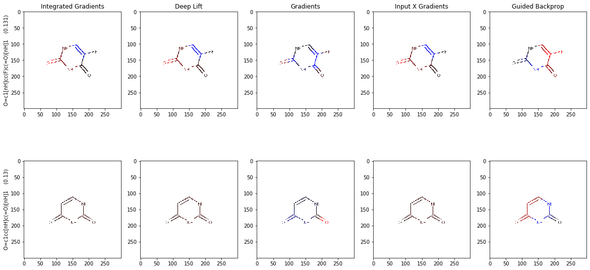

# Explainability-COVID

The project aims to apply different Explainability Methods to Molecules Dataset. In particular two examples are provided:

- Solubility Dataset: GraphNN_Solubility.ipynb
	https://www.kaggle.com/c/drug-solubility-challenge

	

- COVID Dataset: GraphNN_COVID.ipynb
	https://www.ebi.ac.uk/chembl/document_report_card/CHEMBL4303122/

	

Folder `papers/` contains some pdfs on literature related works,

Folder `datasets/` contains the used dataset in csv format

Folder `models/` contains pretrained models for both examples 

